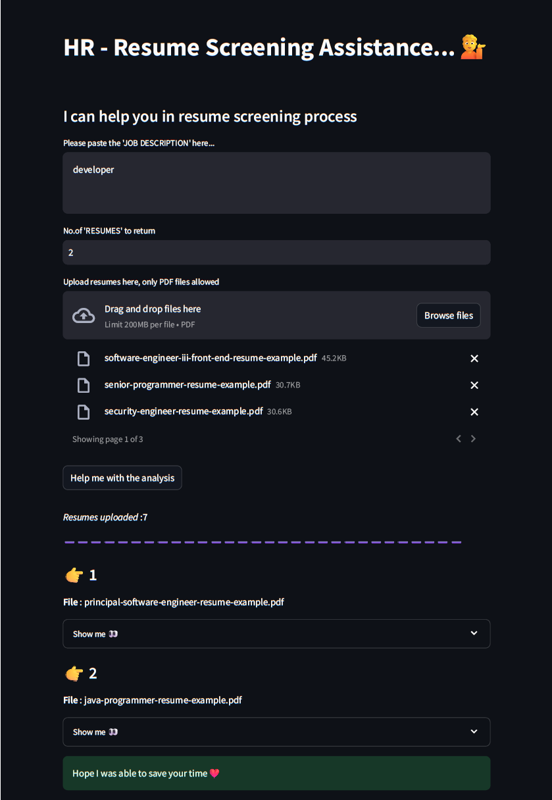
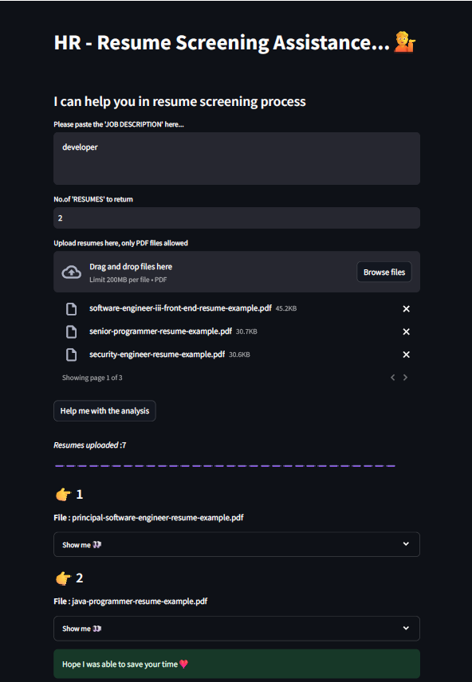

# Resume Screening Assistance

## Overview

This project is a web application built using Streamlit that assists HR professionals in the resume screening process. The application allows users to upload multiple resumes in PDF format and provides relevant insights based on a given job description. It leverages embeddings and Pinecone for storing and retrieving relevant documents.

## Features

- Upload multiple PDF resumes.
- Input job description for analysis.
- Retrieve and display relevant resumes based on the job description.
- Generate summaries of the relevant resumes.

## Technologies Used

- **Streamlit**: For building the interactive web application.
- **Pinecone**: For storing and retrieving vector embeddings.
- **LangChain**: To create and manage agents for processing data and queries.
- **Hugging Face**: Provides the language model endpoint for natural language processing.
- **dotenv**: For managing environment variables.
- **Python**: General programming and scripting.

## Setup

### Prerequisites

- Python 3.7 or later
- Streamlit
- Pinecone
- LangChain
- Hugging Face library
- dotenv

### Usage

1. **Navigate to the Application:**

    Open your web browser and go to `http://localhost:8501` (or the URL where Streamlit is running).

2. **Enter Job Description:**

    Paste the job description into the text area provided.

3. **Specify Number of Resumes:**

    Input the number of resumes you want to return for analysis.

4. **Upload Resumes:**

    Upload the resumes in PDF format using the file uploader.

5. **Submit for Analysis:**

    Click the "Help me with the analysis" button to start the process.

6. **View Results:**

    The application will display the relevant resumes and their summaries based on the job description.

## Code Structure

- `your_script.py`: The main script for running the Streamlit application.
- `utils.py`: Contains utility functions for creating embeddings, pushing to Pinecone, retrieving similar documents, and generating summaries.
- `.env`: Stores environment variables for API keys and other configuration settings.
- `requirements.txt`: Lists all the required Python packages for the project.

<<<<<<< HEAD

=======

>>>>>>> b764d8198d99a28df6a293465196f56cc528bd3f
