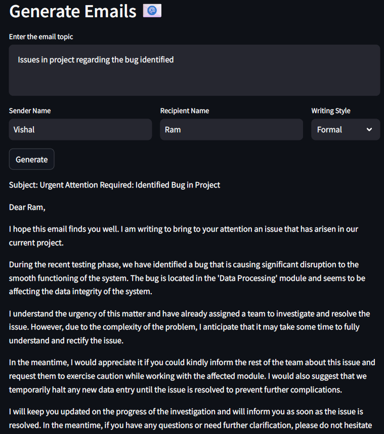

# Generate Emails Application

## Overview

This project is a web application built using Streamlit that allows users to generate emails based on a given topic, sender name, recipient name, and writing style. It utilizes the Llama-2-7B-Chat model through the CTransformers library to generate the email content.

## Features

- Input email topic, sender name, recipient name, and select writing style.
- Generate email content using the Llama-2-7B-Chat model.
- Display the generated email content.

## Technologies Used

- **Streamlit**: For building the interactive web application.
- **LangChain**: To create and manage the prompt template for the email generation.
- **CTransformers**: For utilizing the Llama-2-7B-Chat model to generate the email content.

## Setup

### Prerequisites

- Python 3.7 or later
- Streamlit
- LangChain
- CTransformers
- Hugging Face library
- dotenv

### Usage

1. **Navigate to the Application:**

    Open your web browser and go to `http://localhost:8501` (or the URL where Streamlit is running).

2. **Enter Email Details:**

    - Enter the email topic in the provided text area.
    - Input the sender name.
    - Input the recipient name.
    - Select the writing style from the dropdown menu.

3. **Generate Email:**

    Click the "Generate" button to generate the email content based on the provided details.

4. **View Results:**

    The application will display the generated email content.

## Code Structure

- `your_script.py`: The main script for running the Streamlit application.
- `utils.py`: Contains utility functions for creating embeddings, pushing to Pinecone, retrieving similar documents, and generating summaries.
- `.env`: Stores environment variables for API keys and other configuration settings.
- `requirements.txt`: Lists all the required Python packages for the project.

## Detailed Functionality

- **Session Variables:**
  - `unique_id`: A unique identifier for each session to query and get only the user-uploaded documents from the Pinecone vector store.

- **Main Functionality:**
  - Load environment variables using `load_dotenv()`.
  - Set up Streamlit page configuration.
  - Capture email topic, sender name, recipient name, and writing style.
  - Generate a unique session ID.
  - Create a list of documents from uploaded PDF files.
  - Display the count of uploaded resumes.
  - Create embeddings and push data to Pinecone.
  - Fetch relevant documents from Pinecone based on the job description.
  - Display relevant documents with details and summaries.

