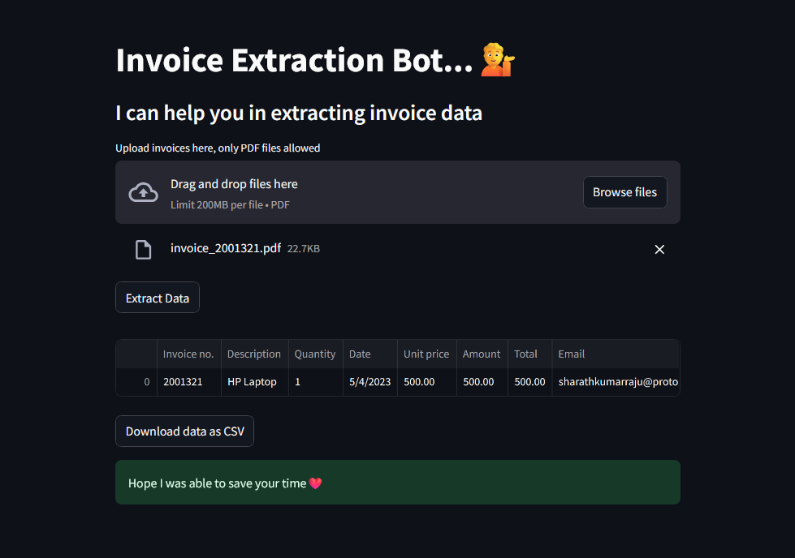

# Invoice Extraction Bot

## Overview

This project is a web application built using Streamlit that assists users in extracting data from invoices in PDF format. The application allows users to upload multiple invoice PDFs and provides extracted data in a tabular format. Users can download the extracted data as a CSV file.

## Features

- Upload multiple PDF invoices.
- Extract data from uploaded invoices.
- View the extracted data in a table.
- Download the extracted data as a CSV file.

## Technologies Used

- **Streamlit**: For building the interactive web application.
- **dotenv**: For managing environment variables.
- **Python**: General programming and scripting.

## Setup

### Prerequisites

- Python 3.7 or later
- Streamlit

