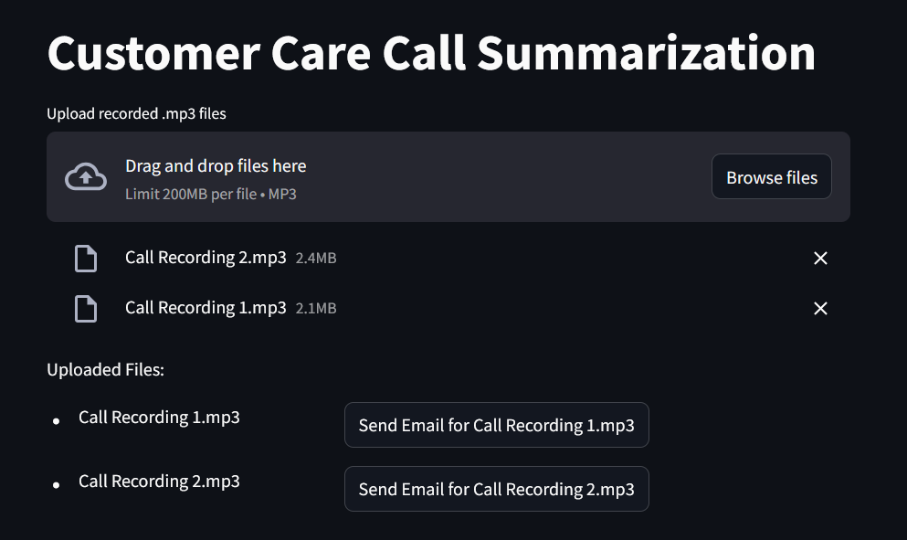

# Customer Care Call Summarization

## Overview

This project is a web application built using Streamlit that allows users to upload multiple recorded .mp3 files of customer care calls and send summaries of these calls via email. The application leverages a utility function to handle the email summarization process.

## Features

- Upload multiple .mp3 files.
- Display the uploaded files in a tabular format.
- Send an email summary for each uploaded file.

## Technologies Used

- **Streamlit**: For building the interactive web application.
- **Python**: General programming and scripting.

## Usage

1. **Navigate to the Application:**

    Open your web browser and go to `http://localhost:8501` (or the URL where Streamlit is running).

2. **Upload .mp3 Files:**

    Use the file uploader to select and upload your .mp3 files.

3. **Send Email Summaries:**

    For each uploaded file, click the "Send Email" button to send a summary of the call.

