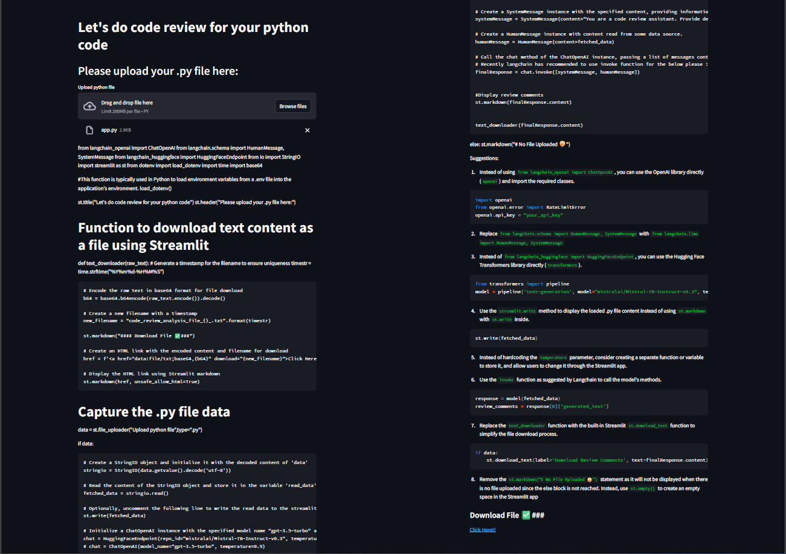

# Code Review Application

## Overview

This project is a web application built using Streamlit and LangChain that allows users to upload Python files and receive detailed code reviews. The application leverages language models from Hugging Face to provide insights and suggestions for improving the uploaded code.

## Features

- Upload a Python (.py) file.
- Receive detailed code review and improvement suggestions.
- Download the review analysis as a text file.

## Technologies Used

- **Streamlit**: For building the interactive web application.
- **LangChain**: To manage interactions with language models.
- **Hugging Face**: Provides the language model endpoint for natural language processing.
- **Python**: General programming and scripting.

## Setup

### Prerequisites

- Python 3.7 or later
- Streamlit
- LangChain
- Hugging Face library

## Usage

1. **Navigate to the Application**:

    Open your web browser and go to `http://localhost:8501` (or the URL where Streamlit is running).

2. **Upload a Python File**:

    Use the file uploader to select and upload your Python (.py) file.

3. **Receive Code Review**:

    The application will display the code review analysis on the screen.

4. **Download the Analysis**:

    Click the provided link to download the code review analysis as a text file.

