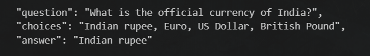

# App 6: MCQ Quiz Creator Bot

+ The bot creates mcq based questions using the documents provided.
+ The documents are converted into chunks of data to feed into the llm
+ The chunks of data is turned into to vector embeddings and stored in a pinecone databse
+ A similarity search is performed from the vector database using the user input.
+ The llm generates a response using the user input and the relevant vectors.
+ The output is converted into json using a json template.

## LLM

**used:** mistralai/Mistral-7B-Instruct-v0.2

+ all-MiniLM-L6-v2

## Framework

+ LangChain
+ Pinecone

## Flow of the App

