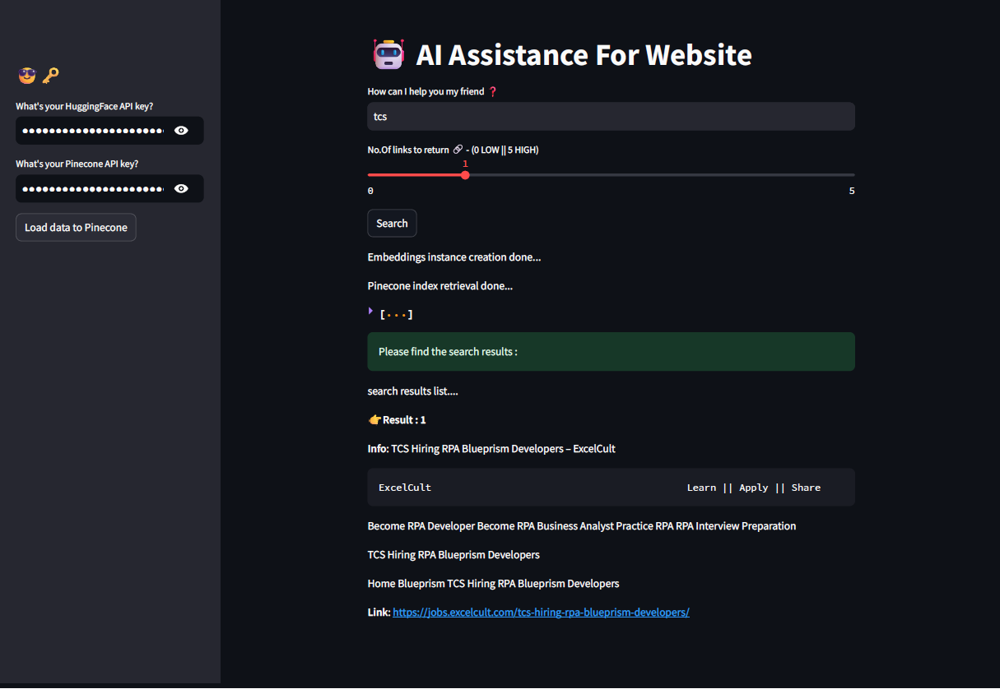

# AI Assistance For Website

This is a Streamlit application designed to provide AI assistance for website data retrieval and search functionality using the HuggingFace and Pinecone APIs. The app captures user inputs for the search query and returns relevant documents based on the query.

## Features

- **Session State Management**: Uses Streamlit's session state to manage the HuggingFace and Pinecone API keys securely.
- **Sidebar Input**: Capture the HuggingFace and Pinecone API keys from the user.
- **Data Loading**: Load data from a website to Pinecone for indexing.
- **Search Functionality**: Retrieve relevant documents from Pinecone based on user queries.
- **Display Results**: Displays the relevant documents and their sources.

## How It Works

1. **Session State Initialization**: The application initializes session state variables for the HuggingFace and Pinecone API keys to manage user inputs securely.

2. **Sidebar Functionality**:
    - Users can input their HuggingFace and Pinecone API keys.
    - The "Load data to Pinecone" button triggers the process of fetching data from a website, splitting it into chunks, creating embeddings, and pushing the data to Pinecone.

3. **Main Interface**:
    - Users can input their search query and specify the number of relevant links to return.
    - Clicking the "Search" button triggers the process of creating embeddings, retrieving the Pinecone index, fetching relevant documents, and displaying the search results.

## Key Components

- **API Key Management**: Securely captures and manages HuggingFace and Pinecone API keys.
- **Data Loading to Pinecone**:
  - Fetches data from a specified website.
  - Splits the data into manageable chunks.
  - Creates embeddings for the data chunks.
  - Pushes the embeddings and data chunks to Pinecone for indexing.
- **Search Functionality**:
  - Creates embeddings for the search query.
  - Retrieves the Pinecone index.
  - Fetches and displays relevant documents based on the search query.

## Example Usage

1. **Load Data to Pinecone**:
    - Enter your HuggingFace and Pinecone API keys in the sidebar.
    - Click on "Load data to Pinecone" to load website data for indexing.
    - The app will fetch data from the website, create embeddings, and push the data to Pinecone.

2. **Search for Relevant Documents**:
    - Enter your search query in the main input box.
    - Specify the number of relevant links to return using the slider.
    - Click on "Search" to retrieve and display relevant documents from Pinecone.

## Screenshots

